# Homework Submission - Day 3

Ho ten: Vũ Đặng Hải Đăng

---

## 1) Tong quan bai lam

### Cac bai da hoan thanh

- [x] Bai 1: Mo rong Scan API (khong tinh bonus)
- [x] Bai 2: Unit Tests (Model + Scanner)
- [x] Bai 3: Tich hop Frontend
- [x] Bai 4: CI/CD voi GitHub Actions
- [x] Bai 5: Deploy voi Docker Compose
- [ ] Bai 6: Bonus
- [ ] Bai 7: Bonus
- [ ] Bai 8: Bonus
- [ ] Bai 9: Bonus

### File code chinh da cap nhat

- app/session7-deployment/backend/internal/handler/scan_handler.go
- app/session7-deployment/backend/internal/service/scan_service.go
- app/session7-deployment/backend/internal/scanner/port_scanner.go
- app/session7-deployment/backend/internal/handler/cors_middleware.go
- app/session7-deployment/backend/cmd/server/main.go
- app/session7-deployment/frontend/vite.config.js
- app/session7-deployment/frontend/.env
- app/session7-deployment/frontend/.env.example
- .github/workflows/ci.yml
- app/session7-deployment/DOCKER_GUIDE.md
- app/session7-deployment/docker-compose.yml

---

## 2) Bai 1 - Mo rong Scan API

### Yeu cau da dap ung

- Them scan type ip va port
- Ho tro workflow scan job:
  - POST /assets/{id}/scan
  - GET /scan-jobs/{id}
  - GET /scan-jobs/{id}/results
- Co safety check cho active scan port (chi localhost/private range)
- Co log scan activities
- Co ket qua scan cho ip/port luu vao DB

### Minh chung API test

#### 2.1 Tao asset domain va ip

```bash
DOMAIN_ASSET=$(curl -s -X POST http://localhost:8080/assets \
  -H "Content-Type: application/json" \
  -d '{"name":"google.com","type":"domain"}' | jq -r '.id')

IP_ASSET=$(curl -s -X POST http://localhost:8080/assets \
  -H "Content-Type: application/json" \
  -d '{"name":"127.0.0.1","type":"ip"}' | jq -r '.id')

echo "$DOMAIN_ASSET"
echo "$IP_ASSET"
```
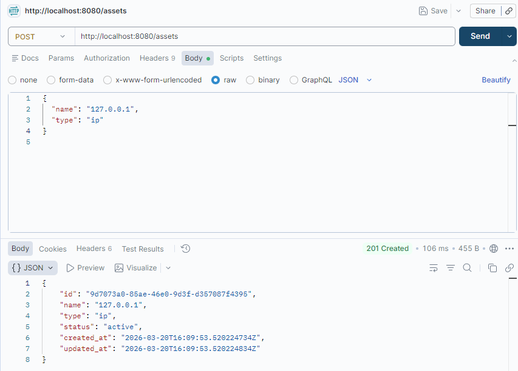

#### 2.2 Start IP scan va Port scan

```bash
IP_JOB=$(curl -s -X POST "http://localhost:8080/assets/$IP_ASSET/scan" \
  -H "Content-Type: application/json" \
  -d '{"scan_type":"ip"}' | jq -r '.id')

PORT_JOB=$(curl -s -X POST "http://localhost:8080/assets/$IP_ASSET/scan" \
  -H "Content-Type: application/json" \
  -d '{"scan_type":"port"}' | jq -r '.id')

echo "$IP_JOB"
echo "$PORT_JOB"
```

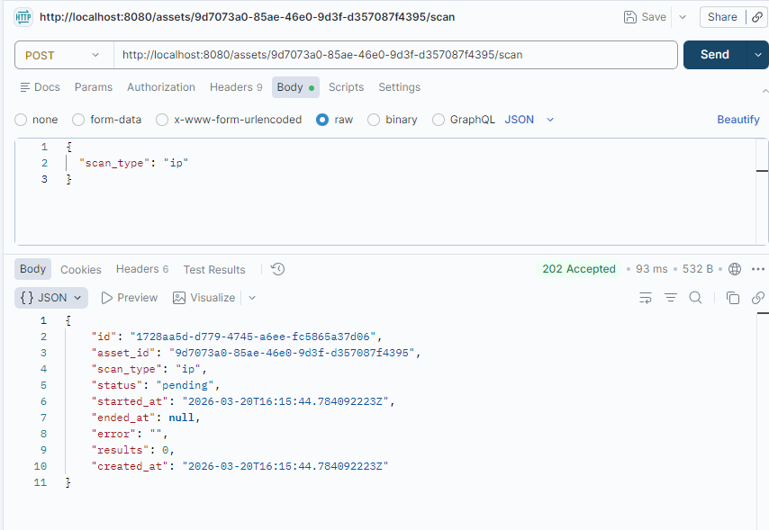

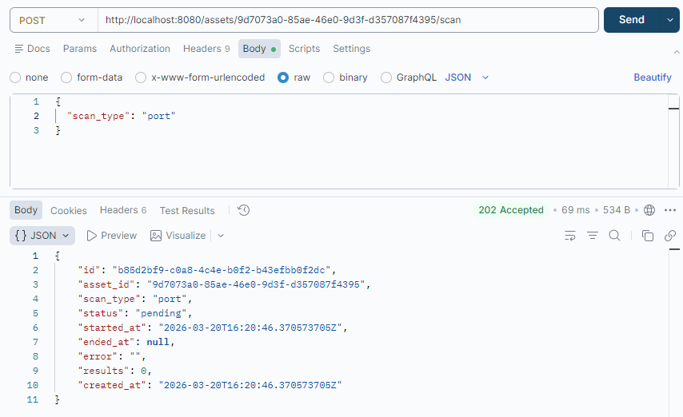

#### 2.3 Poll status va lay results

```bash
curl -s "http://localhost:8080/scan-jobs/$IP_JOB" | jq
curl -s "http://localhost:8080/scan-jobs/$IP_JOB/results" | jq

curl -s "http://localhost:8080/scan-jobs/$PORT_JOB" | jq
curl -s "http://localhost:8080/scan-jobs/$PORT_JOB/results" | jq
```

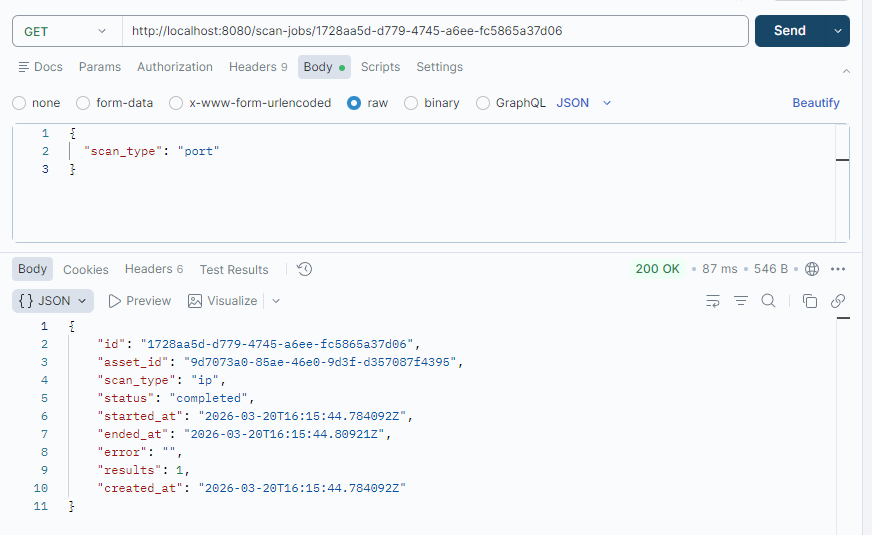
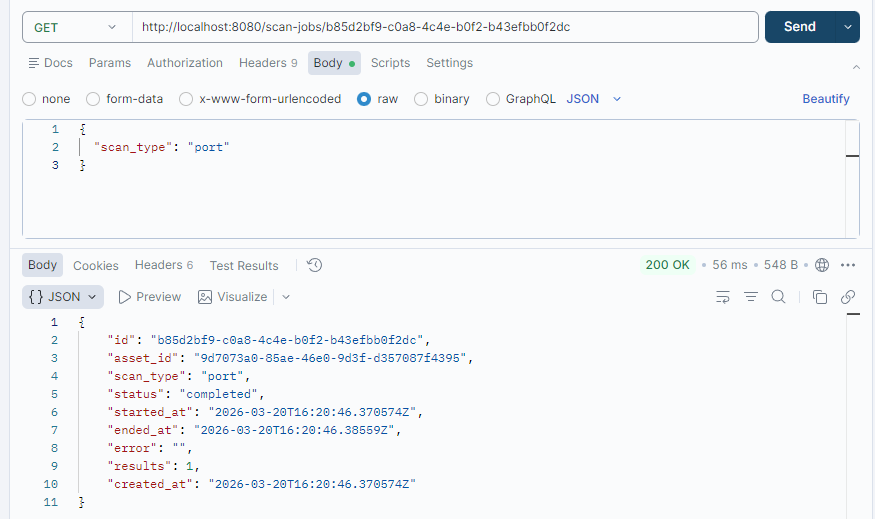

##### Ket qua
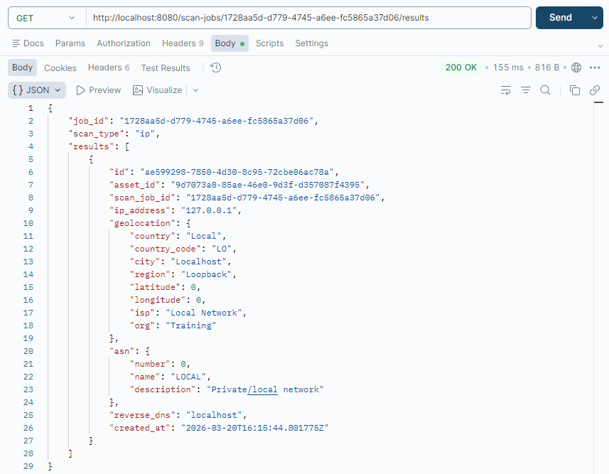
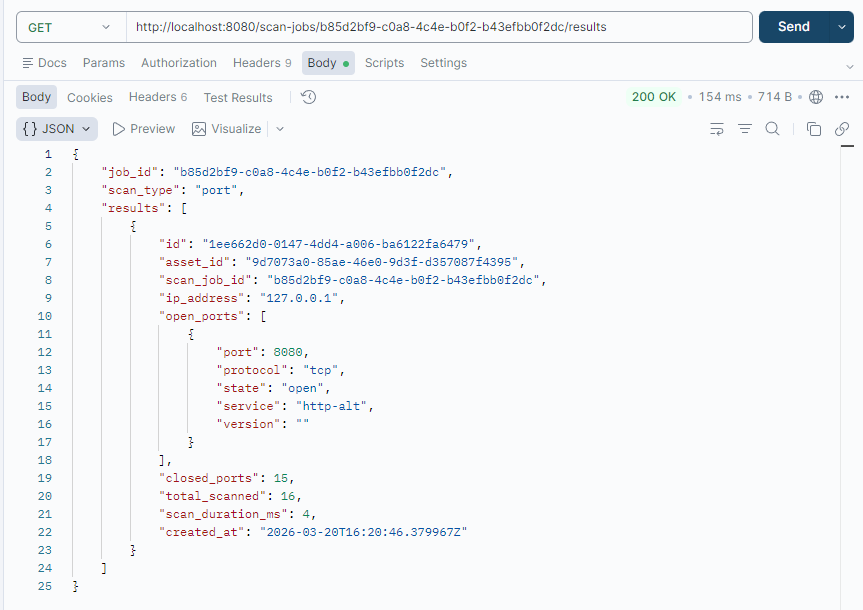
#### 2.4 Kiem tra safety check voi public IP

```bash
PUBLIC_IP_ASSET=$(curl -s -X POST http://localhost:8080/assets \
  -H "Content-Type: application/json" \
  -d '{"name":"8.8.8.8","type":"ip"}' | jq -r '.id')

curl -s -X POST "http://localhost:8080/assets/$PUBLIC_IP_ASSET/scan" \
  -H "Content-Type: application/json" \
  -d '{"scan_type":"port"}' | jq
```
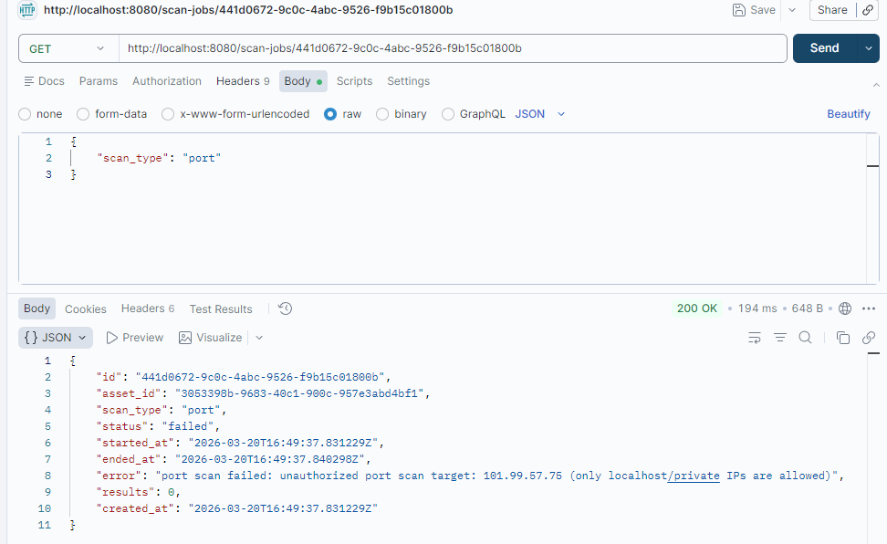


---

## 3) Bai 2 - Unit Tests

### Yeu cau da dap ung

- Model tests
- Scanner tests cho dns/whois/subdomain/ip/port

### Lenh test

```bash
cd app/session7-deployment/backend

go test ./...
go test -cover ./...
go test -coverprofile=coverage.out ./...
go tool cover -html=coverage.out -o coverage.html
```

### Ket qua test

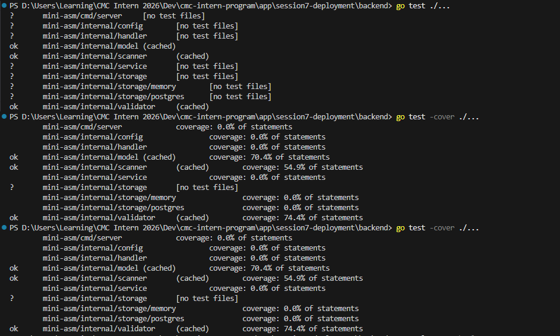

### Danh sach file test bo sung

- internal/scanner/dns_scanner_test.go
- internal/scanner/whois_scanner_test.go
- internal/scanner/subdomain_scanner_test.go
- internal/scanner/ip_scanner_test.go
- internal/scanner/port_scanner_test.go

---

## 4) Bai 3 - Tich hop Frontend

### Yeu cau da dap ung

- Da them CORS middleware backend
- Da cau hinh frontend env: VITE_API_URL=http://localhost:8080
- Frontend goi backend qua /api va hien thi du lieu

### Luong test UI

1. Mo frontend: http://localhost:3000
2. Tao asset moi
3. Xem danh sach assets
4. Khoi tao scan
5. Xem scan results
6. Xoa asset

### Minh chung

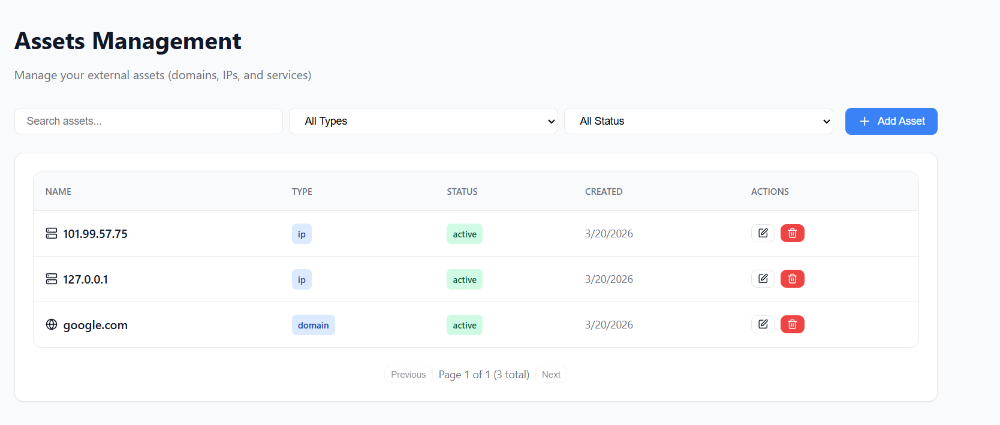
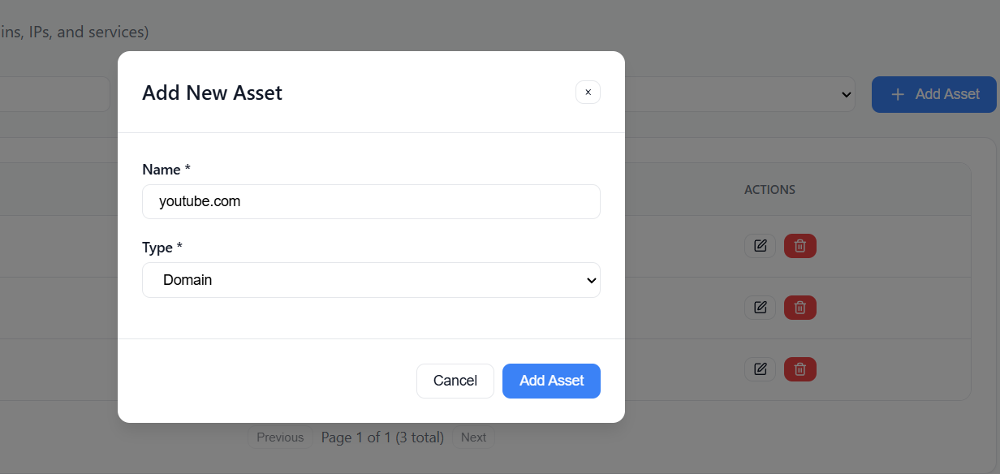

---

## 5) Bai 4 - CI/CD GitHub Actions

### Yeu cau da dap ung

- Workflow file: .github/workflows/ci.yml
- Co cac jobs:
  - backend build + test
  - frontend build
  - docker build
  - integration test
  - gosec
  - trivy
  - gitleaks
  - trufflehog


## 6) Bai 5 - Deploy voi Docker Compose

### Yeu cau da dap ung

- Full stack da chay bang docker compose
- Frontend truy cap duoc o localhost:3000
- Backend health check pass

### Lenh deploy va verify

```bash
cd app/session7-deployment

docker compose up -d
docker compose ps
curl http://localhost:8080/health
```

### Minh chung bat buoc

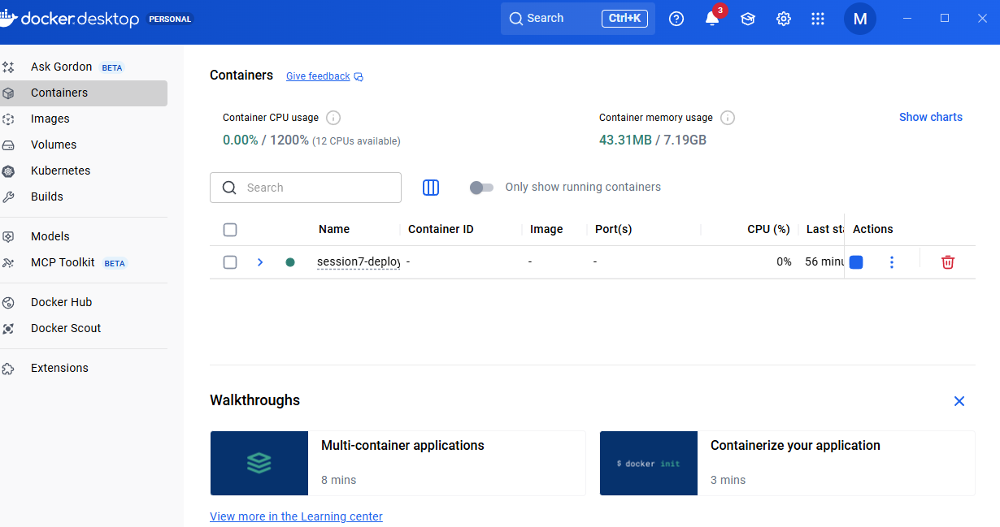
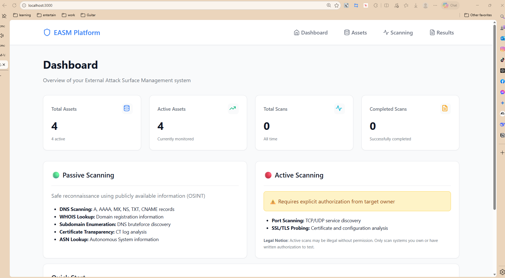
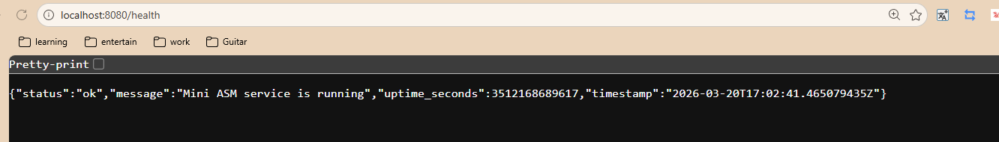


